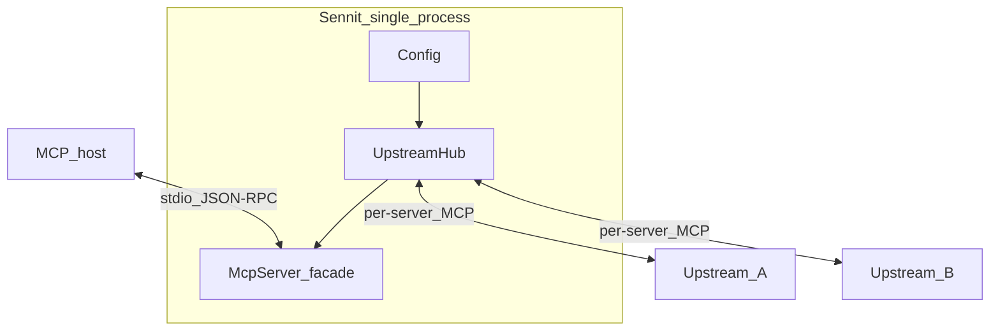

# Sennit

**Sennit is an MCP aggregator:** your editor or agent connects to **one** MCP server on stdio, and Sennit proxies **many** upstream MCP servers behind it. You get a single merged catalog—tools, prompts, and static resources—using predictable names like `serverKey__upstreamTool`.

**Why use it**

- **One slot in the host** — Configure Cursor, Claude Desktop, or any MCP client once; swap or add upstreams only in Sennit’s config.
- **Central place for secrets** — Env vars and HTTP headers live in one file (with redacted `plan` / `config print`), not scattered across every tool’s launch config.
- **Parallel upstream work** — Built-in `sennit.batch_call` runs many upstream `tools/call` operations concurrently using raw `(serverKey, toolName)` pairs.
- **Explicit wiring** — No scanning `PATH` or IDE globals; every upstream is listed in config so behavior stays reproducible.

| Install | Source |
|---------|--------|
| **`npx sennit`** / **`npx -y sennit`** | [Alphabetsoup16/sennit](https://github.com/Alphabetsoup16/sennit) |

## Architecture

The host speaks MCP to Sennit only. Sennit is an MCP **server** toward the host and an MCP **client** toward each upstream (child stdio processes and/or remote Streamable HTTP endpoints).



After startup, Sennit probes upstreams (in parallel where possible), merges **`tools/list`**, **`prompts/list`**, and **`resources/list`**, and registers proxied handlers. The merged catalog is fixed until the host reconnects. Calls on `alpha__search` go to upstream `alpha`’s tool `search`; `sennit.batch_call` addresses upstreams by `serverKey` + raw tool name in one request.

## Quick start

```bash
npx sennit doctor
```

From a clone of this repo:

```bash
npm ci && npm run validate
npx sennit doctor
```

**Config** (optional import from a host `mcp.json` that has top-level `mcpServers`):

```bash
npx sennit setup --from /path/to/mcp.json   # or: npx sennit setup
npx sennit onboard --config "$(npx sennit config path)"
```

**Run the facade:**

```bash
npx sennit serve
npx sennit serve -c examples/sennit.config.example.yaml
```

CLI inventory and flags: [`src/cli/commands/README.md`](src/cli/commands/README.md) (`plan`, `doctor`, `config`, `call`, …).

## Configuration

Sennit reads YAML or JSON: **`version: 1`**, **`servers`** (each entry is **`transport: stdio`** or **`transport: streamableHttp`** with **`url`**), optional per-server allowlists (`tools`, `resources`, `prompts`), **`lazy`** / **`idleTimeoutMs`**, plus top-level **`roots`**, **`toolsListDescriptionMaxChars`**, **`dynamicToolList`**.

Resolution order: **`--config`** → **`SENNIT_CONFIG`** → **`./sennit.config.yaml`** / **`.yml`** → default user path from **`sennit config path`**. Set **`SENNIT_LOG=json`** for structured stderr lines on proxied tool calls.

**Authoritative field reference, redaction rules, and roots modes:** [`src/config/README.md`](src/config/README.md) · **Sample file:** [`examples/sennit.config.example.yaml`](examples/sennit.config.example.yaml)

## What the host sees

| Name | Role |
|------|------|
| **`sennit.meta`** | Operator JSON: version, upstream keys, naming rules, capability notes |
| **`sennit.batch_call`** | Parallel upstream `tools/call` by `serverKey` + upstream tool name |
| **`{key}__{tool}`** | Proxied tool |
| **`{key}__{prompt}`** | Proxied prompt |
| **`{key}__{resource}`** | Proxied static resource (façade URI) |

Implementation detail (hub, bridges, batching): [`src/aggregator/README.md`](src/aggregator/README.md)

## Documentation map

| You want… | Start here |
|-----------|------------|
| **Config schema, paths, redaction** | [`src/config/README.md`](src/config/README.md) |
| **CLI commands** | [`src/cli/commands/README.md`](src/cli/commands/README.md) |
| **Package layout & public API** | [`src/README.md`](src/README.md) |
| **Aggregator behavior & file roles** | [`src/aggregator/README.md`](src/aggregator/README.md) |
| **How to extend / roadmap-adjacent hooks** | [`docs/EXTENDING.md`](docs/EXTENDING.md) |
| **Releases** | [`docs/PUBLISHING.md`](docs/PUBLISHING.md) |
| **Tests** | [`tests/README.md`](tests/README.md) |
| **Contributing** | [`CONTRIBUTING.md`](CONTRIBUTING.md) |

## Roadmap

Shipped highlights include Streamable HTTP upstreams, merged prompts, roots policies, sampling and elicitation passthrough to the host, lazy connect, idle disconnect, optional `dynamicToolList` hints, and `SENNIT_LOG`. Gaps and extension points: [`docs/EXTENDING.md`](docs/EXTENDING.md).

## License

[MIT](LICENSE) — Copyright (c) 2026 Spencer Wolf
