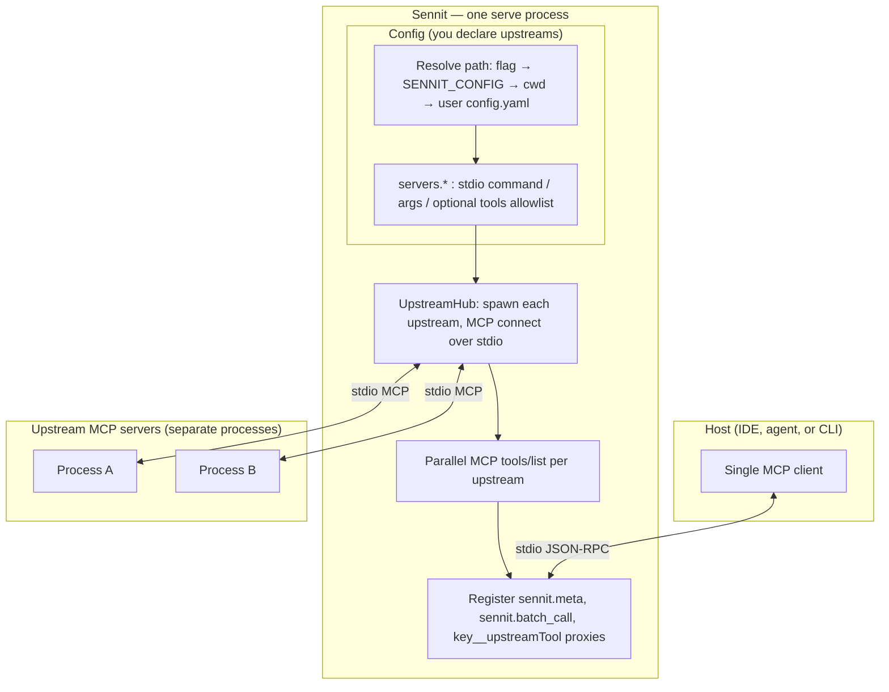

# Sennit

**One MCP server in your host** that fans out to several upstream MCP servers over stdio, merges their tool catalogs with predictable names, and exposes **`sennit.batch_call`** so strict hosts can run many upstream tool calls in parallel.

| Install / run | Source & issues |
|----------------|------------------|
| npm: **`sennit`** (`npx sennit`, `npx -y sennit`) | [Alphabetsoup16/sennit](https://github.com/Alphabetsoup16/sennit) |



**Call path (conceptual):** the host only talks to Sennit. A **`tools/call`** on **`someKey__toolName`** becomes **`callTool`** on the MCP client for **`someKey`**. **`sennit.batch_call`** fans out **`callTool`** to many **`(serverKey, toolName)`** pairs in parallel without using namespaced ids.

## How upstream tools appear (discovery)

Sennit **does not** auto-scan your machine for MCP tools (no crawling `PATH`, no reading Cursor’s global config, no guessing processes).

What happens instead:

1. **You declare upstreams** in a Sennit config file (`servers.<key>` with `command` / `args` for each stdio server).
2. **On startup**, Sennit spawns each upstream and connects as an MCP **client**.
3. For each connected upstream it calls the MCP **`tools/list`** request and registers **proxies** on the Sennit server as **`{serverKey}__{upstreamToolName}`** (in parallel across upstreams).
4. Optional **`tools`** array per server is an **allowlist** of upstream tool names; if omitted, every tool returned by `tools/list` is exposed.

So “discovery” is **protocol-level** (whatever each upstream reports via MCP), not **environment-level** (whatever happens to be installed on disk).

## Quick start

```bash
npm ci && npm run validate
npx sennit doctor
```

**First-time install (recommended):** write a per-user config, optionally cloning **stdio** entries from your host’s **`mcp.json`** (Cursor / VS Code style: top-level **`mcpServers`**), then add a single Sennit entry from **`onboard`**:

```bash
npx sennit setup --from /path/to/your/mcp.json
npx sennit setup   # or: empty servers: {} at the default user path
npx sennit onboard --config "$(npx sennit config path)"
```

Use **`sennit config path`** for the default per-user **`config.yaml`** path (**`XDG_CONFIG_HOME`**, etc.).

**CLI essentials:** **`sennit plan`** · **`sennit help`** · **`sennit version`** (**`--json`**) · **`sennit config`** (**`path`**, **`print`**, **`validate`**) · **`sennit doctor`** / **`doctor inspect`**. Full inventory: [`src/cli/commands/README.md`](src/cli/commands/README.md).

Serve (uses config resolution below):

```bash
npx sennit serve
npx sennit serve --config examples/sennit.config.example.yaml   # requires build: mock lives under dist/
```

## Configuration

- **`version: 1`**
- **`servers.<key>`**: `{ transport: stdio, command, args?, env?, cwd?, tools? }`
- **`tools`**: optional list of **upstream** tool names to expose; omit to expose all tools from `tools/list`.
- **`roots`** (optional): **`mode`**: **`ignore`** (default) | **`forward`** | **`intersect`**; for **`intersect`**, set **`allowUriPrefixes`** (non-empty). Upstream servers that call **`roots/list`** receive roots derived from the **host** per policy. Details: [`docs/PASSTHROUGH-AND-MERGE.md`](docs/PASSTHROUGH-AND-MERGE.md).

**Config file resolution** (first match wins): **`--config`** → env **`SENNIT_CONFIG`** → **`./sennit.config.yaml`** / **`./sennit.config.yml`** in the current working directory → **per-user** **`…/sennit/config.yaml`** (see **`sennit config path`**) → if none exist, empty **`servers`** (**`sennit.meta`** + **`sennit.batch_call`** only).

The per-user path is a stable place for “my upstreams” without checking a project file into git: macOS **`~/Library/Application Support/sennit/config.yaml`**, Windows **`%APPDATA%\sennit\config.yaml`**, Linux **`~/.config/sennit/config.yaml`**, or **`$XDG_CONFIG_HOME/sennit/config.yaml`** when set.

## Tool surface (on the Sennit server)

| Name | Role |
|------|------|
| **`sennit.meta`** | JSON: version, upstream keys, namespacing rules |
| **`sennit.batch_call`** | Parallel upstream calls: raw **`serverKey`** + upstream **`toolName`** (not the namespaced id) |
| **`{key}__{name}`** | Single-call proxy to one upstream tool |

## Repository map

| Path | Notes |
|------|--------|
| [`src/`](src/README.md) | TypeScript source; per-folder READMEs |
| [`docs/EXTENDING.md`](docs/EXTENDING.md) | Where to add CLI commands, config, transports, tools |
| [`docs/PASSTHROUGH-AND-MERGE.md`](docs/PASSTHROUGH-AND-MERGE.md) | Passthrough + merge policies (**roots** forward / intersect / ignore / map), tool-chain analysis |
| [`docs/ENGINEERING_QUALITY_PLAN.md`](docs/ENGINEERING_QUALITY_PLAN.md) | Quality backlog (robustness, tests, validation) — kept current with the codebase |
| [`docs/PUBLISHING.md`](docs/PUBLISHING.md) | npm publish checklist |
| [`tests/`](tests/README.md) | Vitest + integration patterns |
| [`examples/`](examples/) | Sample YAML |
| [`CONTRIBUTING.md`](CONTRIBUTING.md) | Dev setup and layout |

## License

[MIT](LICENSE) — Copyright (c) 2026 Spencer Wolf
