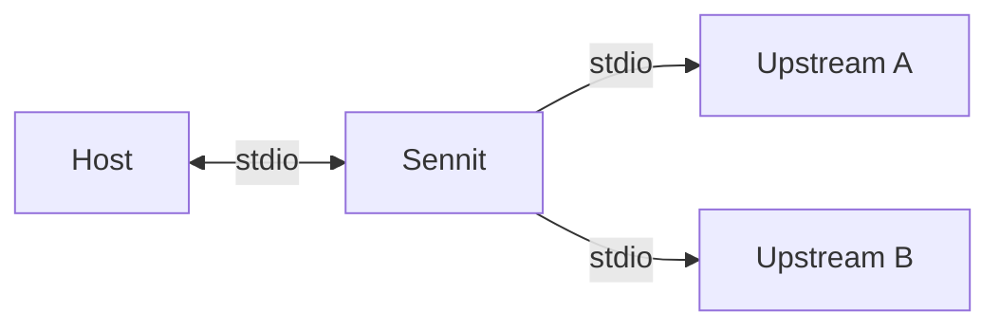

# Sennit (`mcp-parallel`)

MCP **aggregator**: stdio upstreams, merged tools as `serverKey__toolName`, and **`sennit.batch_call`** to run many upstream calls in parallel from one host tool.



## Develop

```bash
npm ci && npm run validate
npx sennit doctor
npx sennit onboard   # paste into Cursor mcp.json; fix config path
```

```bash
npx sennit serve
npx sennit serve --config examples/sennit.config.example.yaml   # needs build (mock fixture in dist/)
```

## Config

`version: 1`; `servers.<key>` = `{ transport: stdio, command, args?, env?, cwd?, tools? }`.  
Optional `tools` allowlists upstream tool names.

Config resolution: `--config` → `SENNIT_CONFIG` → `./sennit.config.yaml|.yml` → empty `servers`.

## Tools

| Name | Role |
|------|------|
| `sennit.meta` | Version, upstream keys, naming (JSON) |
| `sennit.batch_call` | Parallel calls: `serverKey` + upstream `toolName` |
| `{key}__{name}` | Single upstream proxy |

## Repo

| Path | Notes |
|------|--------|
| [`src/`](src/README.md) | Source + per-folder READMEs |
| [`docs/EXTENDING.md`](docs/EXTENDING.md) | **Where to add** CLI commands, config, transports, tools |
| [`docs/PUBLISHING.md`](docs/PUBLISHING.md) | npm publish checklist |
| [`tests/`](tests/README.md) | Vitest |
| [`examples/`](examples/) | Sample YAML |
| [`CONTRIBUTING.md`](CONTRIBUTING.md) | Setup + TS layout |

## License

[MIT](LICENSE) — Copyright (c) 2026 Spencer Wolf
