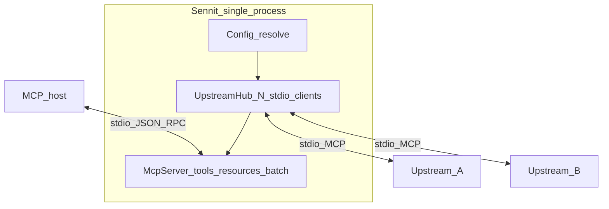

# Sennit

One **MCP server** in the host: stdio to **N** upstream MCP servers, merged **`key__tool`** names, built-in **`sennit.batch_call`** for parallel upstream **`tools/call`**.

| Install | Repo |
|---------|------|
| **`npx sennit`** / **`npx -y sennit`** | [Alphabetsoup16/sennit](https://github.com/Alphabetsoup16/sennit) |



**Inside `face`:** after connect, **`tools/list`** and **`resources/list`** run in parallel per upstream; merged catalog is fixed for the session.

**Call path:** host → Sennit only. **`tools/call`** on **`someKey__toolName`** → upstream **`callTool`** for **`someKey`**. **`sennit.batch_call`** uses raw **`(serverKey, toolName)`** pairs in parallel (no namespaced ids in the batch payload).

## Discovery (no host scan)

Sennit does **not** read Cursor globals, **`PATH`**, or auto-discover processes.

1. You list upstreams in config (`servers.<key>` → **`command`** / **`args`**).
2. On startup Sennit spawns each process and is an MCP **client** to it.
3. It runs **`tools/list`** (and **`resources/list`** where supported), then registers proxies: **`{serverKey}__{name}`** for tools, opaque **`urn:sennit:resource:v1:…`** URIs for static resources.
4. Optional per-server **`tools`** / **`resources`** arrays allowlist what is exposed; omit = expose all listed by the upstream.

## Quick start

```bash
npm ci && npm run validate
npx sennit doctor
```

**First-time config** (optional import from host **`mcp.json`** with top-level **`mcpServers`**):

```bash
npx sennit setup --from /path/to/mcp.json   # or: npx sennit setup  → empty servers
npx sennit onboard --config "$(npx sennit config path)"
```

**Useful CLI:** **`plan`** · **`doctor`** / **`doctor inspect`** · **`config`** (`path`, `print`, `validate`, `schema`) · **`call`** · **`completion`** · **`help`**. Inventory: [`src/cli/commands/README.md`](src/cli/commands/README.md).

```bash
npx sennit serve
npx sennit serve -c examples/sennit.config.example.yaml   # needs build: mock in dist/
```

## Configuration

| Field | Meaning |
|-------|---------|
| **`version`** | **`1`** |
| **`servers.<key>`** | **`transport: stdio`**, **`command`**, **`args?`**, **`env?`**, **`cwd?`**, **`tools?`**, **`resources?`** |
| **`tools`** | Optional allowlist of upstream tool names; else all from **`tools/list`**. |
| **`resources`** | Optional allowlist of upstream resource URIs (exact match); else all from **`resources/list`**. |
| **`roots`** | **`mode`**: **`ignore`** (default) \| **`forward`** \| **`intersect`**. **`intersect`** requires non-empty **`allowUriPrefixes`**. Controls what upstreams see for **`roots/list`**. |

**Config resolution** (first hit wins): **`--config`** → **`SENNIT_CONFIG`** → **`./sennit.config.yaml`** / **`.yml`** → per-user file (**`sennit config path`**) → empty **`servers`** (only **`sennit.meta`** + **`sennit.batch_call`**).

Per-user default paths: macOS **`~/Library/Application Support/sennit/config.yaml`**, Windows **`%APPDATA%\sennit\config.yaml`**, Linux **`~/.config/sennit/config.yaml`** (or **`$XDG_CONFIG_HOME/sennit/config.yaml`**).

## MCP surface on Sennit

| Name | Role |
|------|------|
| **`sennit.meta`** | JSON: version, upstream keys, naming rules for tools/resources |
| **`sennit.batch_call`** | Parallel **`callTool`** by **`serverKey`** + upstream **`toolName`** |
| **`{key}__{tool}`** | Proxy to one upstream tool |
| **`{key}__{resource}`** + façade URI | Static resource from upstream; **`resources/read`** proxied. Upstream **resource templates** not merged yet. |

## Roadmap (short)

Done: stdio upstreams, tools + static resources merge, roots modes above, **sampling passthrough** (upstream → host when the host declares sampling). Not done: prompts, roots **`map`**, notifications, elicitation, HTTP/SSE upstreams — see [`docs/EXTENDING.md`](docs/EXTENDING.md).

## Repo map

| Path | Role |
|------|------|
| [`src/`](src/README.md) | TypeScript |
| [`docs/EXTENDING.md`](docs/EXTENDING.md) | Where to plug in features |
| [`docs/PUBLISHING.md`](docs/PUBLISHING.md) | Release checklist |

| [`tests/`](tests/README.md) | Vitest |
| [`examples/`](examples/) | Sample YAML |
| [`CONTRIBUTING.md`](CONTRIBUTING.md) | Dev workflow |

## License

[MIT](LICENSE) — Copyright (c) 2026 Spencer Wolf
