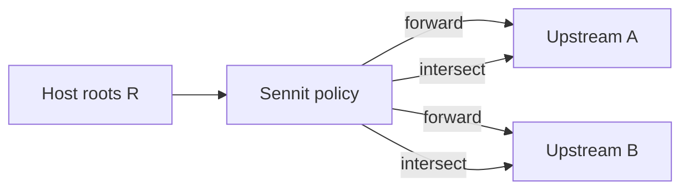

# Passthrough, merge policies, and roots

This document refines the **product direction** for Sennit: **full MCP passthrough** with **explicit, documented merge policies per capability**, plus how **roots** should behave so we avoid “works direct, breaks behind Sennit” failures.

Implementation will land incrementally; this file is the **contract** we implement and test against.

---

## North star

1. **Passthrough by default** — for each MCP capability family, Sennit should behave as if the host spoke to upstreams **through one façade**, not a random subset of features.
2. **Explicit merge policy** — for every capability, we document: **namespacing / deduplication**, **ordering**, **errors**, **capability advertisement** (`Client`/`Server` capabilities), and **what happens on conflict**.
3. **No silent omission** — if we do not support a capability yet, the host must be able to discover that (capabilities + docs), not infer it from missing tools only.

---

## Capability matrix (living)

| Capability | Passthrough surface | Namespace / collision rule | Config hook (future) | Today |
|------------|---------------------|----------------------------|------------------------|--------|
| **Tools** | `tools/list`, `tools/call`, `sennit.batch_call` | `serverKey__upstreamToolName`; duplicate full name → hard error | `servers.*.tools` allowlist | Implemented (stdio) |
| **Resources** | `resources/list`, `resources/read`, subscriptions if any | URI prefix or structured URI map; collision → error or policy | `servers.*.resources` policy TBD | Not implemented |
| **Prompts** | `prompts/list`, `prompts/get` | namespaced prompt id or URI-like id | allowlist TBD | Not implemented |
| **Roots** | Upstream **server** → `roots/list` → Sennit **client** answers from host roots + policy | See **Roots** below | Top-level `roots.mode`, `roots.allowUriPrefixes` | **Phase 1 done:** `ignore` / `forward` / `intersect` on upstream clients; `map` reserved |
| **Sampling / elicitation** | as SDK + host support evolves | single logical “edge” or disallow | feature flag | Not implemented |
| **Notifications** | `list_changed`, etc. | aggregate + forward with source tag | optional | Not implemented |

Each row should eventually link to **tests** (“golden” list/read/get) and **`sennit plan`** extensions so operators see **merged** + **per-upstream** views for that capability.

---

## Roots — behavior matrix

**Roots** scope filesystem or project context. Aggregators break if upstreams assume different roots than the host intended.

### Modes (choose one globally first; per-env profiles later)

| Mode | Behavior | Best when | Risk |
|------|-----------|-----------|------|
| **forward** | Host’s root list is passed to **each** upstream (same set, or documented projection). | Single-user, all upstreams are yours, paths are compatible. | Over-broad: an upstream gets roots it never saw before. |
| **intersect** | Only roots that appear in an **allowlist** and/or satisfy **per-upstream** rules before forwarding. | Shared machines, mixed trust, or “minimum necessary” exposure. | Stricter: some servers may see **empty** roots and misbehave unless configured. |
| **ignore** | Sennit does **not** propagate roots to upstreams; document that servers that **require** roots may fail or be unsafe. | Upstreams ignore roots entirely (rare in file-backed tools). | **Subtle bugs**: tools assume cwd/roots from direct MCP. |
| **map** (advanced) | Config maps host root id/path → per-upstream root or env (`cwd`). | Monorepo + different tools expect different base dirs. | More config surface; must be validated in `plan`. |

**Default recommendation (doc-only until implemented):** start with **intersect** + explicit allowlist for anything beyond a single trusted profile; offer **forward** as an opt-in “power user” mode with a loud doc warning.

### Contract text (for README / errors)

When roots are unsupported or ignored, upstream-facing errors should say **that roots were not forwarded**, not a generic MCP error, so operators grep one string.

---

## Merge policy checklist (per capability)

For each new passthrough feature, answer:

1. **Identity** — How does the host name this entity on the façade vs upstream?
2. **Collision** — Two upstreams expose the same logical id: error, rename, or merge?
3. **Partial failure** — One upstream down: fail open, fail closed, or degrade with `isError`?
4. **Capabilities** — What does Sennit advertise vs what it can actually satisfy?
5. **`sennit plan`** — How does the operator see **raw upstream** vs **merged façade**?
6. **Tests** — At least one integration test per policy branch.

---

## Tool chains, analysis, and optimization

### What we mean by “tool chain”

In practice it is usually **an ordered sequence of `tools/call` invocations** in a session (often **chosen by the model**, not hardcoded). There is rarely a formal DAG in the protocol.

### What **is** possible to analyze

| Signal | Use |
|--------|-----|
| **Wall time + status** per proxied call and per `batch_call` item | Find slow/failing upstreams; SLO dashboards. |
| **Concurrency** (`batch_call` fan-out vs serial proxies) | Capacity planning; already parallel where designed. |
| **Static structure** from config | Which `(serverKey, tool)` pairs **exist**; not which will run. |
| **`batch_call` payload** | Known parallel **set** of calls (good for tracing fan-out). |
| **Optional dev “trace mode”** | Structured logs with correlation id across one host turn (privacy-sensitive; off by default). |

### What is **not** reliably optimizable without extra semantics

- **Next tool is unknown** until the LLM chooses it, so “prefetch tool B after A” is speculative.
- **Semantic dependencies** (“search then summarize”) are not in MCP; inferring them from descriptions is fragile.

### Practical optimizations (realistic)

1. **Keep `listTools` stable and cheap** — already parallelized upstream; avoid redundant re-list on every call.
2. **Connection reuse** — one MCP `Client` per upstream process (already); extend same idea for HTTP transports later.
3. **Timeouts + backpressure** on `callTool` / `batch_call` — prevents one bad upstream from stalling the façade (product + reliability).
4. **Deduplicate identical in-flight calls** — only safe with explicit opt-in and **deterministic** tools (dangerous default).
5. **Offline analysis** — export redacted JSON logs; mine **co-occurrence** (“after `git__status`, often `tests__run`”) as **hints** for docs or UI, not hard rules.

### “Is it possible?” — short answer

**Yes for measurement and reliability** (latency, errors, batch shape, capacity). **Limited for automatic semantic “chain optimization”** unless you add app-specific rules or the host sends explicit dependency metadata. The frontier path is **observability first**, then **optional policy** (e.g. allowlisted call pairs in enterprise mode), not magic graph optimization.

---

## Related

- [`EXTENDING.md`](EXTENDING.md) — where code plugs in.
- **[`sennit plan`](../README.md)** — dry-run includes redacted config (with **`roots`**) + upstream **`tools/list`** + merged tools.

---

## Implementation roadmap (keep in sync with code)

| Phase | Scope | Status |
|-------|--------|--------|
| **0** | Contract doc + capability matrix + roots modes | Done (`PASSTHROUGH-AND-MERGE.md`) |
| **1a** | Config schema `roots` + validation (`intersect` requires `allowUriPrefixes`) | Done (`src/config/schema.ts`) |
| **1b** | `applyRootsPolicy` + upstream `Client` `roots/list` handler + `makeUpstreamRootsBridge` | Done (`roots-policy.ts`, `roots-bridge.ts`, `upstream-hub.ts`, `build-server.ts`) |
| **1c** | Operator UX: MCP **`sennit.meta`**, **`doctor`**, **`plan`**, **`config print`** surface `roots`; redact `allowUriPrefixes` in printed config | Done |
| **2** | **Resources** passthrough: URI policy, merged list/read, `plan` section, tests | Planned |
| **3** | **Prompts** passthrough + merge rules | Planned |
| **4** | **Roots `map` mode** (per-upstream path mapping) + stricter host capability checks | Planned |
| **5** | **Notifications** (`list_changed` aggregation) + optional hot reload | Planned |
| **6** | **Sampling / elicitation** (behind explicit config + capability matrix row) | Planned |

**Out of scope for Phase 1:** Sennit does not yet re-expose **host** roots on the **Sennit server** to the host (that is the inverse direction: host as client already has roots). Phase 1 only answers **upstream** servers that call **`roots/list`** on Sennit-as-client.

**Operational note:** If the host has not completed MCP session setup, `mcp.server.listRoots()` may throw; Sennit then returns **empty** roots to the upstream (same observable as “host supports no roots”). With **`roots.mode: ignore`**, upstream clients **do not** advertise **`roots`**; use **`forward`** or **`intersect`** only when upstreams actually need workspace roots.
