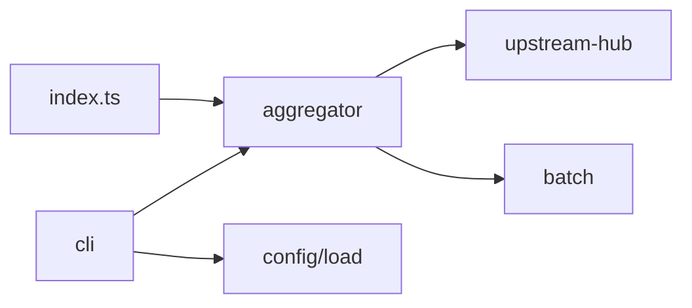

# `src/`

TypeScript source for **Sennit** (npm package **`sennit`**). The published surface is the built **`dist/`** tree; run **`npm run build`** before packaging or running tests that spawn `dist/fixtures/`.

## Packages of responsibility

| Directory | Responsibility |
|-----------|----------------|
| **`aggregator/`** | `createAggregator`: MCP server, upstream `Client`s, merged `tools/list`, `sennit.batch_call` |
| **`cli/`** | **`sennit`** CLI binary: subcommands, config path resolution, onboarding helpers |
| **`config/`** | Zod schema + YAML/JSON load for `servers` |
| **`lib/`** | Pure helpers: namespacing, version string, JSON text for tool responses |
| **`fixtures/`** | Mock stdio MCP subprocess used by tests (not part of runtime aggregator logic) |

## How tools get onto the Sennit server

There is **no** filesystem or host-app scan. Upstreams are **only** those listed under `config.servers`. At aggregator startup, Sennit connects to each and uses MCP **`tools/list`** to learn tool names, then registers **`serverKey__toolName`** proxies (see root README for the full mental model).

**Public API:** `import { createAggregator, … } from "sennit"` from the published build.

**Extend the codebase:** [docs/EXTENDING.md](../docs/EXTENDING.md).
