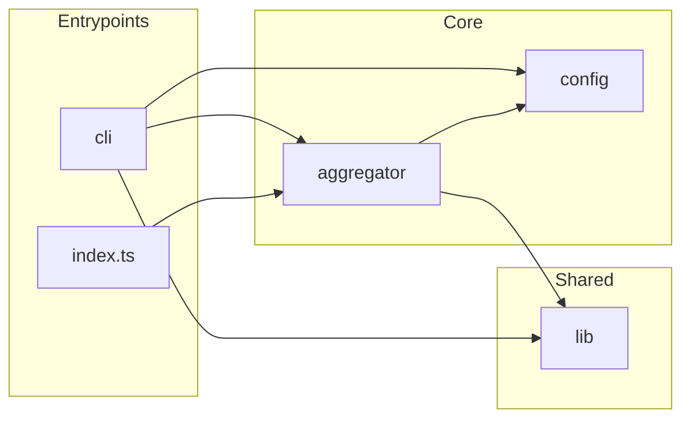

# `src/`

TypeScript source for the **`sennit`** package. Product overview and quick start: [README.md](../README.md). Published output is **`dist/`** — run **`npm run build`** before **`npm pack`** or tests that spawn **`dist/fixtures/`**.

## Layout

| Directory | Role |
|-----------|------|
| **`aggregator/`** | **`createAggregator`**: host **`McpServer`**, **`UpstreamHub`**, namespaced tools / prompts / resources, **`sennit.batch_call`**, sampling + elicitation bridges |
| **`cli/`** | **`sennit`** binary: subcommands, config resolution, onboarding |
| **`config/`** | Zod schema; YAML/JSON load |
| **`lib/`** | Pure helpers (namespace, limits, version, JSON text, errors, optional tool-description truncation, **`SENNIT_LOG=json`** lines) |
| **`fixtures/`** | Mock stdio MCP server for tests only |

Upstreams are defined only in **`config.servers`**. After connect, the hub probes **`tools/list`**, **`prompts/list`** (when advertised), and **`resources/list`** (when supported) per upstream, then registers **`serverKey__name`** entries.

## Documentation map

| Topic | Doc |
|-------|-----|
| Aggregator internals | [aggregator/README.md](aggregator/README.md) |
| Config schema + redaction | [config/README.md](config/README.md) |
| CLI modules | [cli/README.md](cli/README.md) |
| Extending the codebase | [docs/EXTENDING.md](../docs/EXTENDING.md) |

**Published API:** `import { createAggregator, … } from "sennit"` (from the build).
