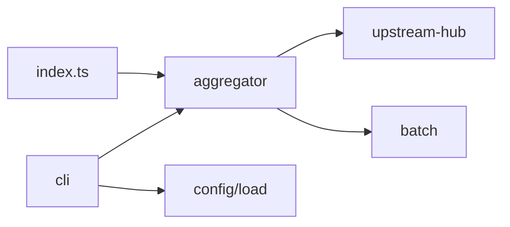

# `src/`

Sennit package source.

| Directory | Role |
|-----------|------|
| `aggregator/` | `createAggregator`, MCP server |
| `cli/` | `sennit` commands |
| `config/` | Schema + YAML/JSON load |
| `lib/` | `namespace`, `version`, `jsonText` |
| `fixtures/` | Test MCP subprocess |

Public API: `import { createAggregator, … } from "mcp-parallel"` (published build).  
Extensions: [`docs/EXTENDING.md`](../docs/EXTENDING.md).
