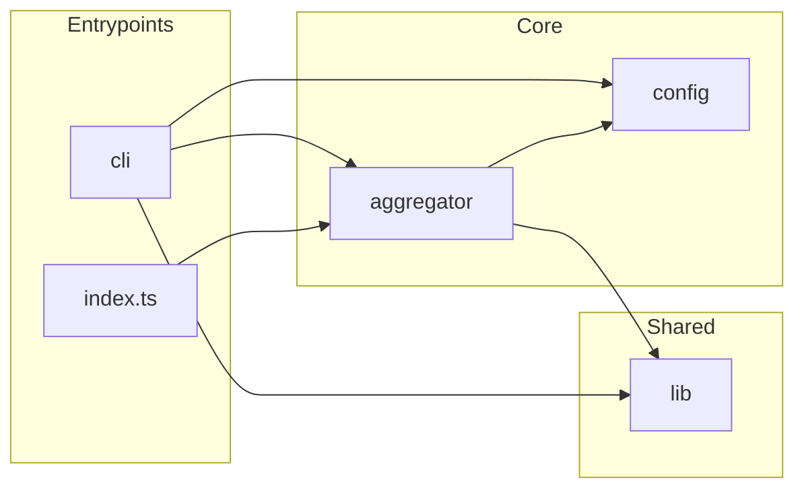

# `src/`

TypeScript for package **`sennit`**. Published output is **`dist/`** — run **`npm run build`** before **`npm pack`** or tests that spawn **`dist/fixtures/`**.

## Layout

| Directory | Role |
|-----------|------|
| **`aggregator/`** | **`createAggregator`**: **`McpServer`**, **`UpstreamHub`**, tool / prompt / resource proxies, **`sennit.batch_call`** |
| **`cli/`** | **`sennit`** binary: subcommands, config resolution, onboarding |
| **`config/`** | Zod schema; YAML/JSON load |
| **`lib/`** | Pure helpers (namespace, version, JSON text, errors) |
| **`fixtures/`** | Mock stdio MCP server for tests only |

Upstreams come **only** from **`config.servers`**. After connect, the aggregator probes **`tools/list`**, **`prompts/list`**, and **`resources/list`** per upstream, then registers **`serverKey__name`** entries. See root [README.md](../README.md).

**Published API:** `import { createAggregator, … } from "sennit"` (from build).

**Contributing:** [docs/EXTENDING.md](../docs/EXTENDING.md).
