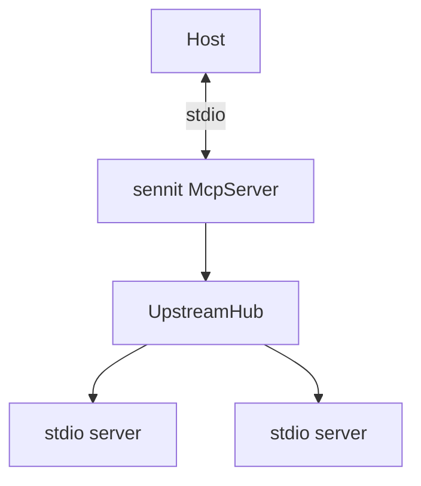

# `src/aggregator`

Sennit **McpServer**: stdio clients per upstream, merged `tools/list`, `tools/call` routing.

| File | Role |
|------|------|
| `upstream-hub.ts` | `Client` + `StdioClientTransport` per server |
| `batch.ts` | Parallel `callTool` for `sennit.batch_call` |
| `build-server.ts` | `createAggregator()` |

Built-ins: `sennit.meta`, `sennit.batch_call`, `{serverKey}__{tool}`.

**Extend:** e.g. HTTP transport in `upstream-hub.ts`. **Avoid:** registering tools after `connect` without list-changed handling.
