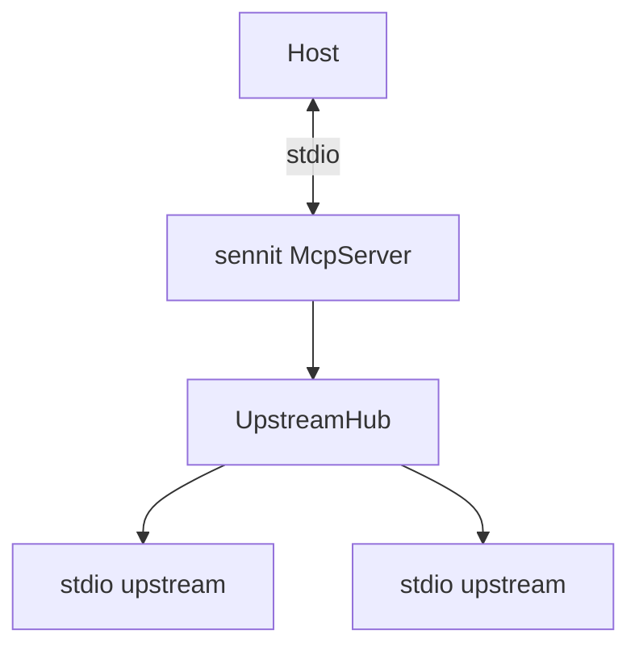

# `src/aggregator`

The **Sennit MCP server**: one **`McpServer`** facing the host, **`UpstreamHub`** holding one MCP **`Client`** per configured stdio upstream, plus **`executeBatchCall`** for **`sennit.batch_call`**.

## Files

| File | Role |
|------|------|
| **`upstream-hub.ts`** | `StdioClientTransport` + `Client` per `servers` entry; optional **`roots/list`** handler toward upstreams |
| **`roots-policy.ts`** | `applyRootsPolicy` — **ignore** / **forward** / **intersect** |
| **`roots-bridge.ts`** | `makeUpstreamRootsBridge` — host `listRoots` → upstream responses |
| **`batch.ts`** | Parallel `client.callTool` for **`sennit.batch_call`** |
| **`proxy-input-schema.ts`** | **`proxyToolInputSchema`**, shared **`looseToolArgumentsSchema`** — map upstream JSON Schema to Zod for **`registerTool`**; fall back to a permissive record when unknown |
| **`build-server.ts`** | **`createAggregator(config)`**: connect hub, register meta + batch + namespaced proxies |

## Tool catalog (built-ins + proxies)

| Registered name | Source |
|-----------------|--------|
| **`sennit.meta`** | Static |
| **`sennit.batch_call`** | Static; arguments validated with Zod |
| **`{serverKey}__{upstreamToolName}`** | One proxy per tool returned by that upstream’s MCP **`tools/list`**, after optional **`servers.<key>.tools`** allowlist |

**Listing upstream tools:** after all transports are connected, Sennit calls **`listTools()`** on each `Client` **in parallel** (`Promise.all` over servers), then registers proxies. It does **not** discover servers beyond the config file.

**Proxied `inputSchema`:** upstreams expose JSON Schema; Sennit builds Zod for common `type: "object"` + `properties` patterns (string / number / integer / boolean, optional vs `required`). Anything else uses a loose object record so registration always succeeds.

**Extend:** e.g. add HTTP/SSE transport beside stdio in **`upstream-hub.ts`**. **Caveat:** if you register new tools after clients have already cached `tools/list`, you need a host that supports list invalidation or reconnect semantics—today the model is “stable catalog after startup.”
