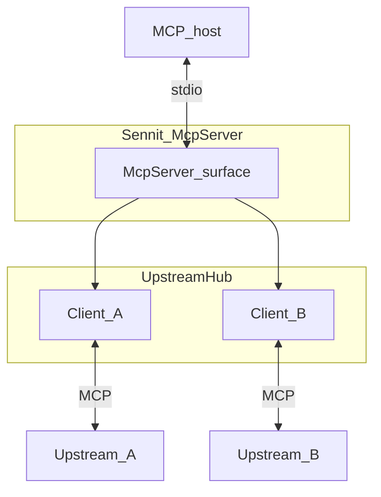

# `src/aggregator`

Host-facing **`McpServer`** plus **`UpstreamHub`**: one MCP **`Client`** per **`servers`** entry (**`stdio`**, **`streamableHttp`**, or legacy **`sse`**). Implements **`sennit.meta`**, **`sennit.batch_call`**, namespaced **tools / prompts / resources** (static + **resource templates**), sampling + elicitation passthrough, optional **lazy** + **idle** lifecycle, optional per-server **`toolCallTimeoutMs`**, optional **`batchCallMaxConcurrency`**, and optional **`dynamicToolList` / `dynamicResourceList` / `dynamicPromptList`** notifications to the host.

## Files

| File | Role |
|------|------|
| **`build-server.ts`** | Re-exports **`createAggregator`** and related entrypoints |
| **`pipeline.ts`** | **`createMcpAndHub`**, **`registerAggregatorSurface`**, **`createAggregator`** wiring |
| **`upstream-probe.ts`**, **`doctor-inspect-types.ts`** | Shared connect + list probes (plan / doctor inspect) |
| **`upstream-hub.ts`** | **`StdioClientTransport`**, **`StreamableHTTPClientTransport`**, or **`SSEClientTransport`** + **`Client`**; **`ensureClient`** / **`touchActivity`**; bridge wiring |
| **`sampling-bridge.ts`** | **`makeUpstreamSamplingBridge(mcp)`** → **`mcp.server.createMessage`** |
| **`elicitation-bridge.ts`** | **`makeUpstreamElicitationBridge(mcp)`** → **`mcp.server.elicitInput`** |
| **`host-list-changed-bridge.ts`** | Host **`send*ListChanged`** when **`dynamicToolList` / `dynamicResourceList` / `dynamicPromptList`** |
| **`list-prompts.ts`**, **`prompt-args-from-listing.ts`** | Paginated **`prompts/list`** + Zod args for **`registerPrompt`** |
| **`roots-policy.ts`** | **`applyRootsPolicy`**, **`applyUpstreamRootRewrites`** (**`mapByUpstream`**) |
| **`roots-bridge.ts`** | Host **`listRoots`** → policy → upstream |
| **`batch.ts`** | **`executeBatchCall`** |
| **`proxy-input-schema.ts`** | Upstream JSON Schema → Zod for **`registerTool`**; loose fallback |
| **`list-resources.ts`** | Paginated **`resources/list`** and **`resources/templates/list`** |
| **`register-resources.ts`** | Merge static resources + **resource templates**; façade URIs / templates + **`resources/read`** proxy |

## Registered surface

| Pattern | Source |
|---------|--------|
| **`sennit.meta`**, **`sennit.batch_call`** | Built-in |
| **`{serverKey}__{tool}`** | After **`servers.<key>.tools`** allowlist (if any) |
| **`{serverKey}__{prompt}`** | After **`servers.<key>.prompts`** allowlist (if any) |
| **`{serverKey}__{resource}`** | After **`servers.<key>.resources`** URI allowlist (if any) |

## Behavior notes

- **`tools/list`**, **`prompts/list`** (when the upstream advertises prompts), and **`resources/list`** (when supported) run **in parallel** across connected clients during catalog build.
- The merged catalog is **fixed for the Sennit session** after registration (no hot reload on the host). **`dynamicToolList`** only tells the host that upstream lists may have changed; reconnect to Sennit to pick up new registrations.
- **`inputSchema`:** common **`object`/`properties`** maps to strict Zod; otherwise a permissive object schema.

**New transport:** extend the discriminated **`servers`** entry in config, then branch in **`upstream-hub.ts`** ([docs/EXTENDING.md](../../docs/EXTENDING.md)).
