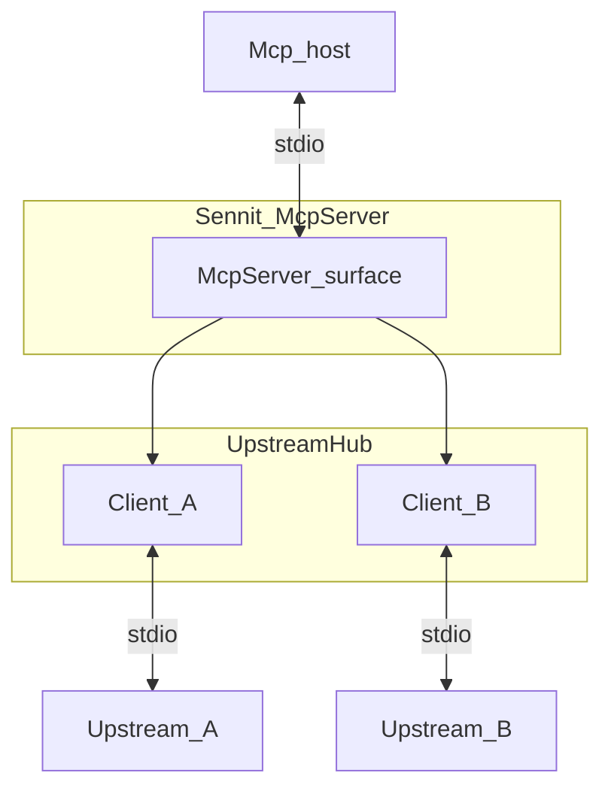

# `src/aggregator`

Host-facing **`McpServer`** plus **`UpstreamHub`** (one MCP **`Client`** per **`servers`** entry, stdio today). Implements **`sennit.meta`**, **`sennit.batch_call`**, namespaced tool proxies, merged static resources, and **sampling passthrough** (upstream `sampling/createMessage` → host via **`sampling-bridge.ts`**).

## Files

| File | Role |
|------|------|
| **`build-server.ts`** | Re-exports **`createAggregator`** and related entrypoints |
| **`pipeline.ts`** | **`createMcpAndHub`**, **`registerAggregatorSurface`**, **`createAggregator`** wiring |
| **`upstream-probe.ts`**, **`doctor-inspect-types.ts`** | Shared connect + **`tools/list`** probe (plan / doctor) |
| **`upstream-hub.ts`** | **`StdioClientTransport`** + **`Client`** per server; optional **`roots/list`** and **`sampling/createMessage`** handlers |
| **`sampling-bridge.ts`** | **`makeUpstreamSamplingBridge(mcp)`** — forwards sampling to **`mcp.server.createMessage`** (host client) |
| **`roots-policy.ts`** | **`applyRootsPolicy`** — **`ignore`** / **`forward`** / **`intersect`** |
| **`roots-bridge.ts`** | Host **`listRoots`** → policy → upstream |
| **`batch.ts`** | **`executeBatchCall`** |
| **`proxy-input-schema.ts`** | Upstream JSON Schema → Zod for **`registerTool`**; loose fallback |
| **`list-resources.ts`** | Paginated **`resources/list`** |
| **`register-resources.ts`** | Merge static resources; **`urn:sennit:resource:v1:…`** façade + **`resources/read`** proxy |

## Registered surface

| Pattern | Source |
|---------|--------|
| **`sennit.meta`**, **`sennit.batch_call`** | Built-in |
| **`{serverKey}__{tool}`** | After **`servers.<key>.tools`** allowlist (if any) |
| **`{serverKey}__{resource}`** | After **`servers.<key>.resources`** URI allowlist (if any) |

**Startup:** **`listTools`** (and resource listing) runs **in parallel** across clients; catalog is **fixed after connect** (no hot reload unless the host reconnects).

**`inputSchema`:** common **`object`/`properties`** maps to strict Zod; otherwise permissive object.

**Next transport:** branch in **`upstream-hub.ts`** (see [docs/EXTENDING.md](../../docs/EXTENDING.md)).
