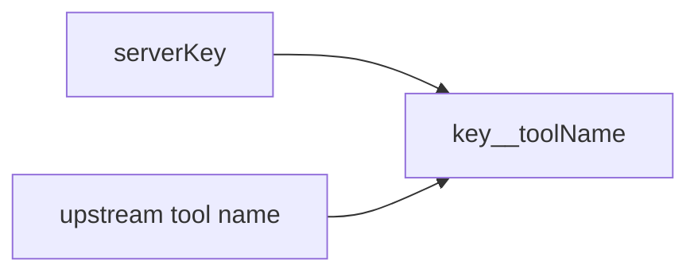

# `src/lib`

Small **pure** helpers (no MCP transports, no process spawning).

| File | Role |
|------|------|
| **`namespace.ts`** | **`TOOL_NAMESPACE_SEPARATOR`**, **`namespacedToolName`**, **`parseNamespaced`** (server keys must not contain the delimiter) |
| **`version.ts`** | Package version string from **`package.json`** |
| **`json-text.ts`** | **`jsonText()`** — stable 2-space JSON for tool `text` content |
| **`error-message.ts`** | **`errorMessage()`** — normalize thrown values for logs and CLI |

This is **namespacing** for merged catalogs, not discovery: which tools exist still comes from each upstream’s MCP **`tools/list`**.
