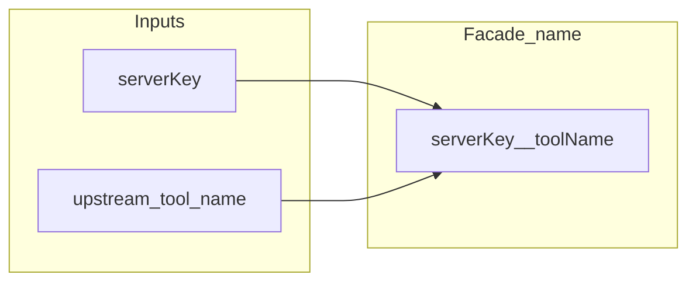

# `src/lib`

Pure helpers — no transports, no subprocesses. Used by the aggregator and CLI.

| File | Role |
|------|------|
| **`namespace.ts`** | **`TOOL_NAMESPACE_SEPARATOR`**, **`namespacedToolName`**, **`parseNamespaced`**, **`takeUniqueMergedToolId`** |
| **`resource-facade.ts`** | Opaque **`urn:sennit:resource:v1:…`** encode/decode; **`urn:sennit:rt:v1:…`** resource-template façade patterns |
| **`fetch-timeout.ts`** | **`wrapFetchWithDeadline`** for HTTP upstream **`fetch`** |
| **`assert-http-upstream-url.ts`** | **`assertHttpOrHttpsUrl`** for remote MCP URLs |
| **`with-timeout.ts`** | **`withAbortTimeout`** — deadline + optional parent **`AbortSignal`**, wired into MCP **`callTool`** so timeouts send cancellation |
| **`paginate-next-cursor.ts`** | **`paginateByNextCursor`** for MCP **`list*`** pagination |
| **`limits.ts`** | Shared caps (e.g. batch size) |
| **`version.ts`** | Version string from **`package.json`** |
| **`json-text.ts`** | **`jsonText()`** — stable 2-space JSON for MCP **`text`** payloads |
| **`error-message.ts`** | **`errorMessage(unknown)`** for logs and CLI |
| **`truncate-tool-description.ts`** | **`truncateForToolList`** when **`toolsListDescriptionMaxChars`** is set |
| **`sennit-json-log.ts`** | One JSON line per proxied tool result when **`SENNIT_LOG=json`** |

Namespacing applies to the merged catalog; which tools exist still comes from each upstream’s **`tools/list`**.
