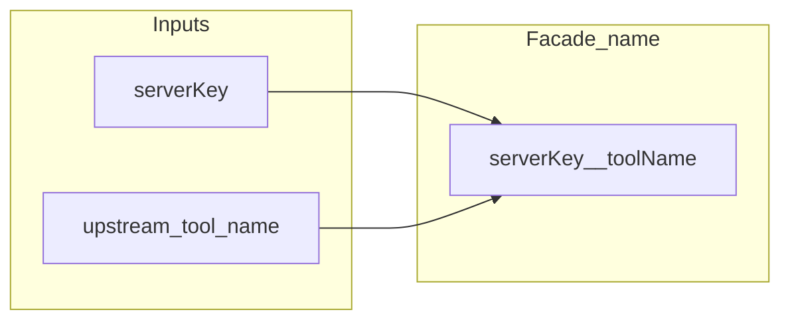

# `src/lib`

Pure helpers — no transports, no subprocesses.

| File | Role |
|------|------|
| **`namespace.ts`** | **`TOOL_NAMESPACE_SEPARATOR`**, **`namespacedToolName`**, **`parseNamespaced`**, **`takeUniqueMergedToolId`** |
| **`resource-facade.ts`** | Opaque **`urn:sennit:resource:v1:…`** encode/decode |
| **`limits.ts`** | Shared caps (e.g. batch size) |
| **`version.ts`** | Version string from **`package.json`** |
| **`json-text.ts`** | **`jsonText()`** — stable 2-space JSON for MCP **`text`** payloads |
| **`error-message.ts`** | **`errorMessage(unknown)`** for logs and CLI |

Namespacing is for the merged catalog only; which tools exist still comes from each upstream’s **`tools/list`**.
